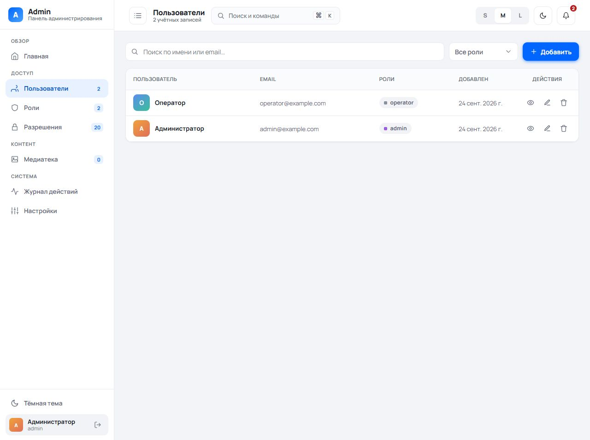
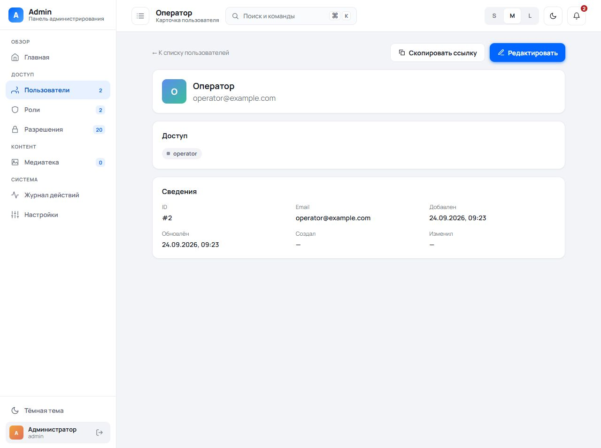
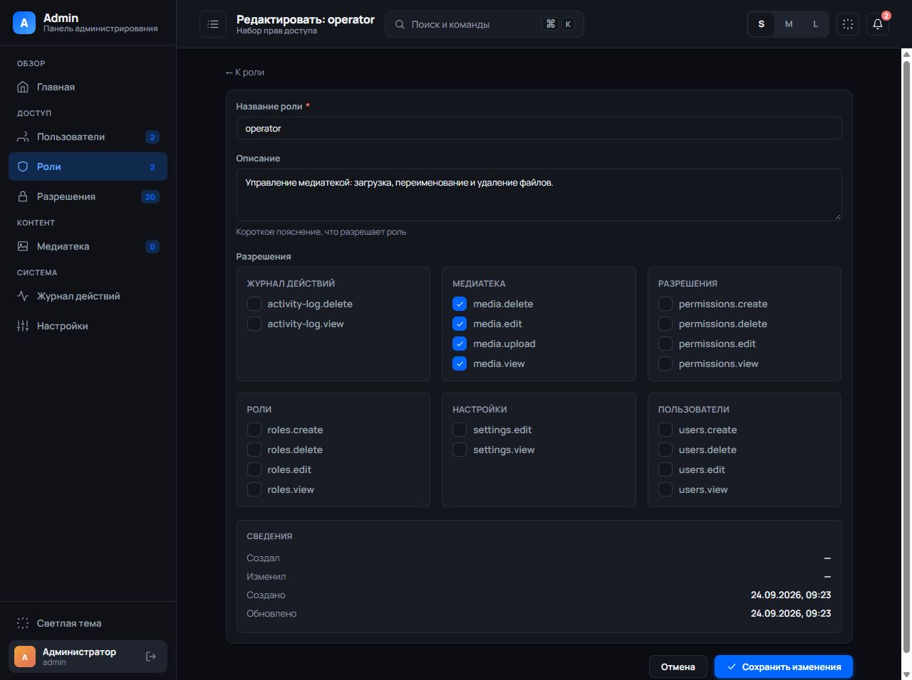
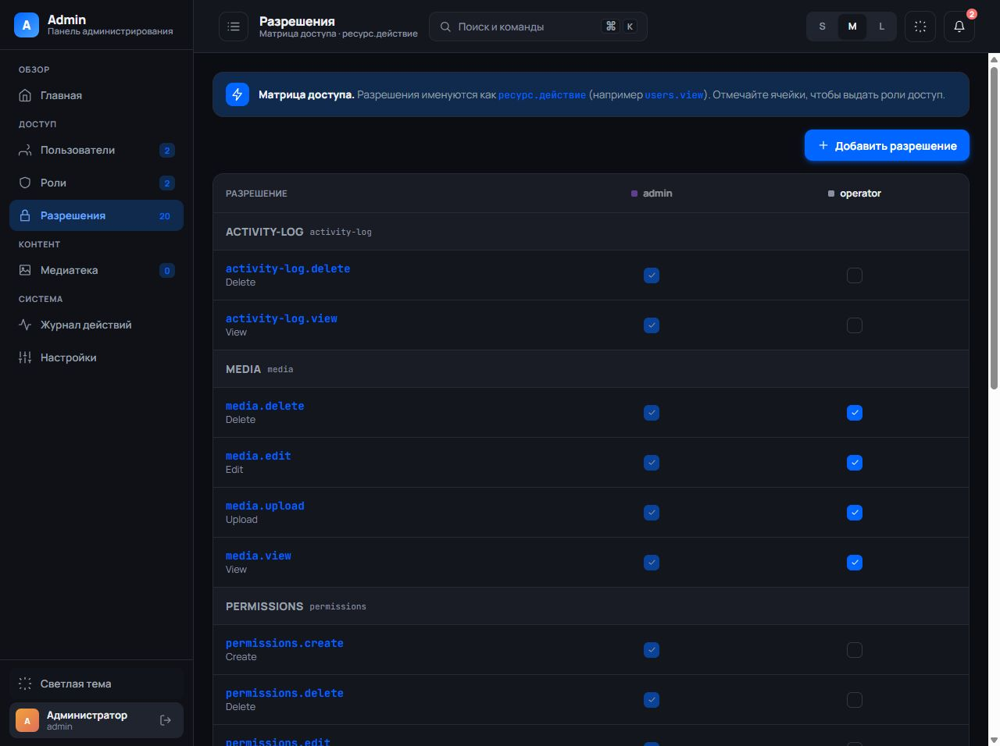

# Laravel Admin Template

An admin-panel template built on **Laravel 12** + **Inertia 3** + **Vue 3.5** (SPA) with the **nergous-ui-vue** design system:

- SPA on Inertia + Vue with the **nergous-ui-vue** design system (dark theme, interface density, command palette);
- **RBAC** via [spatie/laravel-permission](https://spatie.be/docs/laravel-permission) — roles, permissions, a granular access matrix, and a management UI;
- Dedicated user and role pages for viewing, creating, and editing records, with shareable detail URLs;
- A media library with asynchronous uploads, WebP conversion (the `UploadMedia` job + queue), and display-name editing;
- An activity log (`activity_log` + the `LogsActivity` trait) with a JSON diff of changes;
- Application settings (typed key/value).

Use it as a starting point for new projects: clone → remove the demo seeders → add your own entities (see ["How to add your own entity"](#how-to-add-your-own-entity)).

## Interface preview

Screenshots of the running admin panel with the template's demo accounts in an
isolated SQLite database. The interface is in Russian; both light and dark themes
and three interface densities are available.

**Users — search, role filters, sorting, and links to view or edit each account.**



<details>
<summary>User details — share a record with another administrator</summary>

Each user has a stable detail URL, a copy-link action, assigned roles, and a
separate editing page. Roles follow the same view/create/edit pattern.



</details>

<details>
<summary>Role editor — grouped permissions, dark theme, and compact density</summary>

Edit a role's description and permissions on a dedicated page. Permissions are
grouped by resource; the screenshot shows the compact (S) density.



</details>

<details>
<summary>Access matrix — compare permissions across roles</summary>

Manage role access from one matrix. The system administrator's permissions stay
enabled and protected from editing.



</details>

---

## Stack

- **PHP** ^8.4 · **Laravel** ^12
- **Inertia** ^3 (`inertiajs/inertia-laravel`) · **Vue** ^3.5 + **TypeScript** — SPA (a single Blade template, everything else in Vue)
- **Vite** 8 · **nergous-ui-vue** 1.0.4 from npm, a Vue component library with no runtime dependencies beyond Vue
- **spatie/laravel-permission** ^8 (RBAC)
- **SQLite** by default (compatible with MySQL/MariaDB/PostgreSQL)
- Queues: the `database` driver — for asynchronous media processing

---

## Requirements (manual installation)

None of this is needed for the [Docker](#docker) path — the extensions and versions are
baked into the image. For running locally without Docker:

- **PHP** 8.4+ with the `pdo_sqlite` (the default database), `gd` with WebP support
  (media optimization; without it originals are stored without thumbnails — `ImageOptimizer`
  silently falls back), `mbstring`, and `intl` extensions.
- **Composer** 2.
- **Node.js** ≥ 20.19 or ≥ 22.12 (required by Vite 8) + npm.

## Quick start

```bash
git clone <repo> my-new-project
cd my-new-project

cp .env.example .env            # Windows (PowerShell): copy .env.example .env
composer install
npm install
php artisan key:generate

# Create the database (for SQLite — an empty file)
touch database/database.sqlite  # Windows (PowerShell): New-Item database/database.sqlite

php artisan migrate --seed      # creates the admin/operator roles and test users
php artisan storage:link        # symlink public/storage → serves uploaded media (otherwise 404)
npm run build
php artisan serve
# in another terminal:
php artisan queue:work          # processes media uploads (or QUEUE_CONNECTION=sync — no worker, see Troubleshooting)
```

After `--seed`, the following will be available:

- `admin@example.com` / `password123` (the `admin` role, all permissions)
- `operator@example.com` / `password123` (the `operator` role, media library only)

**Do not use the seeder in production.** To remove the test users: drop `UserSeeder::class` from `DatabaseSeeder`, or run `php artisan app:create-admin` to create a proper admin and delete them through the UI.

### Composer scripts

| Command          | Purpose                                                                                                                                                                          |
| ---------------- | ------------------------------------------------------------------------------------------------------------------------------------------------------------------------------- |
| `composer setup` | Turnkey setup for SQLite: composer/npm + SQLite file + migrations + seeds (roles/permissions + demo users in `local`) + `storage:link` + build. Afterwards you can log in immediately as `admin@example.com` / `password123` |
| `composer dev`   | In parallel: artisan serve, queue listen, pail (logs), vite                                                                                                                     |
| `composer test`  | Clears the config cache and runs PHPUnit (`tests/Feature` and `tests/Unit`)                                                                                                     |

The frontend is built with Vite: `npm run dev` — a dev server with HMR, `npm run typecheck` — strict TypeScript/Vue check, `npm run build` — a production build.

### Creating an administrator

```bash
php artisan app:create-admin admin@example.com "Administrator Name"
```

The command seeds the base RBAC itself (the permission catalog + granting them to the
superadmin role, idempotently) and assigns the role to the user. As a result it produces a
**working** admin even on a fresh database with no seeds (after a bare `migrate`) — without
it the superadmin role would be left with no permissions, and the admin would get a 403 in
every section.

**Password policy:** passwords set through this command or the users UI require at least
15 characters, upper- and lowercase letters, a digit and a symbol. The UI can generate
and copy a 20-character password. Demo seed passwords bypass validation; replace demo
accounts before production use.

---

## Docker

The image is multi-stage, based on **FrankenPHP** (Caddy + PHP 8.4 in a single process).
PHP extensions: `pdo_mysql`/`pdo_pgsql`/`pdo_sqlite`, `redis`, `gd` (WebP), `intl`,
`bcmath`, `pcntl`, `zip`, `mbstring`, `opcache` (+ JIT in prod). The application runs
as the unprivileged `www-data` user.

### Development (hot reload)

`compose.dev.yaml` brings up: `app` (FrankenPHP, code mounted via bind-mount,
PHP changes are picked up), `vite` (HMR on `:5173`), `queue` (`queue:listen`),
`db` (MariaDB), and `redis`.

```bash
cp .env.example .env          # the defaults (local, debug) are fine as-is
docker compose -f compose.dev.yaml up --build
```

- Application: <http://localhost:8000> · Vite HMR: <http://localhost:5173>
- `vendor/` and `node_modules/` are installed automatically on first start
  (into named volumes, to avoid conflicting with host permissions).
- In dev, `RUN_SEEDS=true` — demo roles and test users are created only when the
  database is empty. Restarts leave existing users and permissions untouched.

### Production (self-contained stack)

`docker-compose.yml` brings up: `app` (web), `queue` (`queue:work`),
`scheduler` (`schedule:work`), `db` (MariaDB), and `redis` — each with its own
healthcheck and a named volume for data. Code and dependencies are baked into the image
(immutable); only `storage` is mounted out.

```bash
cp .env.example .env
# Set in .env:
#   APP_ENV=production, APP_DEBUG=false, APP_URL=https://your-domain
#   APP_KEY=...                      (required; generate it with `php artisan key:generate --show` and paste it in.
#                                     In production the entrypoint does NOT generate it — it fails with an error,
#                                     so the key persists across restarts)
#   TRUSTED_PROXIES=<proxy subnet>   (if behind a reverse proxy; see below)
# Uncomment the "Docker-compose" block in .env (DB_*/REDIS_* -> the db/redis hosts)
# Set RUN_MIGRATIONS=true for this first boot; return it to false after provisioning.

docker compose up -d --build
```

- The application's external port: `APP_PORT` (default `8888` → container `:8000`).
  Behind a TLS proxy (nginx/traefik) the application stays on HTTP. To receive the
  client's real IP (rather than the proxy's address), set `TRUSTED_PROXIES` = the proxy's
  subnet/IP; by default proxies are not trusted, so `X-Forwarded-For` cannot be spoofed
  (this protects the login throttle). In production the session cookie is marked `Secure` automatically.
- Migrations run with `RUN_MIGRATIONS=true` (default `false`). Enable this for first
  boot or a release, then return it to `false` before ordinary rebuilds. Base RBAC
  is seeded only if the migrated database has no application data; subsequent
  restarts and releases preserve existing roles and permissions. `queue` and
  `scheduler` do not migrate. `queue:work` is optional — if you don't need
  asynchronous file processing, set `QUEUE_CONNECTION=sync`.
- **Base RBAC** (roles + permissions) is initialized once for an empty database.
  **Demo/production USERS** are included on that first initialization only when
  `RUN_SEEDS=true` (default `false` in production). If the database already has
  application data, both kinds of seeds are skipped. Create an admin:
  `docker compose exec -it app php artisan app:create-admin ...` (`-it` is required — the
  command prompts for a password interactively), or set `RUN_SEEDS=true` +
  `ADMIN_PASSWORD` so the production admin is created automatically. Either way, the admin
  gets the full set of permissions out of the box.
- **The production database is not SQLite.** Uncomment the `DB_*` block in `.env`
  (`DB_CONNECTION=mariadb`, `DB_HOST=db`, …). If you leave the default
  `DB_CONNECTION=sqlite`, the entrypoint **fails with a clear error**: SQLite in a container
  is ephemeral and would lose data on recreation. For a deliberate SQLite on a persistent
  volume — `ALLOW_SQLITE_IN_PRODUCTION=true`.
- The database (`db`) is not published externally — it is reachable only within the stack's network.
  To use an external database, set `DB_HOST` to the external address and remove the
  `db` service (+ its `depends_on`).

Useful commands:

```bash
docker compose logs -f app                       # application logs
docker compose exec app php artisan migrate      # manual migration
docker compose exec app php artisan tinker       # console
docker compose down                              # stop (volumes are kept)
docker compose down -v                           # tear down along with data
```

---

## What's included

### Out of the box

| Section          | URL                   | Permission          |
| ---------------- | --------------------- | ------------------- |
| Dashboard        | `/admin`              | (auth only)         |
| Users            | `/admin/users`        | `users.view`        |
| Roles            | `/admin/roles`        | `roles.view`        |
| Permissions      | `/admin/permissions`  | `permissions.view`  |
| Media library    | `/admin/media`        | `media.view`        |
| Activity log     | `/admin/activity-log` | `activity-log.view` |
| Settings         | `/admin/settings`     | `settings.view`     |
| Backups          | `/admin/backups`      | `backups.view`      |
| My profile       | `/admin/profile`      | (auth only)         |
> The "Permission" column is access to the section (viewing). Actions are gated **granularly**: create/edit — `*.create`/`*.edit` (in `FormRequest::authorize()`), delete — `*.delete` (middleware on destroy routes). For media: upload — `media.upload`, rename — `media.edit`, delete — `media.delete`. Settings: write — `settings.edit`. If you create a custom role with `*.view` but without `*.delete`, the server-side protection still kicks in (403), but you should also hide the delete buttons in the UI via `can('*.delete')` (see `resources/js/lib/can.ts`).

### Base permissions

The `RolePermissionSeeder` seeder creates:

- `users.{view,create,edit,delete}`
- `roles.{view,create,edit,delete}`
- `permissions.{view,create,edit,delete}`
- `media.{view,upload,edit,delete}`
- `activity-log.{view,delete}`
- `settings.{view,edit}`
- `backups.{view,create}`

These base permissions are marked `is_system`: routes and FormRequests depend on them, so
they cannot be renamed or deleted from the matrix. Permissions you add in the UI stay editable.

Roles: `admin` — all permissions; `operator` — media library only (`media.*`). Both are marked `is_system`.

Add your own using the `module.action` format — the roles UI groups checkboxes by the prefix before the dot.

### Settings

The `/admin/settings` section is a typed key/value store (`App\Models\Setting`).
Its structure is defined by the `Setting::SCHEMA` constant (group → key → `[type, default]`): the
`general` group (application name, timezone, favicon), `seo` (meta tags, og-image, indexing), and
`security` (session lifetime, the `login_throttle` login-attempt limit). Values are cached
and invalidated on write; validation is handled by `UpdateSettingsRequest`.

Dates are stored in UTC. The `timezone` setting only controls how the admin panel
*displays* dates (and how date filters/CSV export interpret days).

The SEO group feeds `resources/views/public.blade.php`, a root layout for the public part
of the site (title template, description, canonical, robots, favicon, Open Graph). Extend it
from your pages and override per page with `@section('title')`, `@section('description')`,
`@section('og_image')`. Sitemap generation behind the `sitemap` flag is left to your project.

> **For your own project:** the branding defaults (`app_name`, `meta_title_template`,
> `canonical_domain`) in `Setting::SCHEMA` are neutral placeholders; replace them here
> or through the UI. The `/admin` dashboard is also a demo: its KPIs are tied to the
> template's entities — rewrite it for your own domain (`AdminDashboardController` + `pages/Dashboard.vue`).

### UI features

- **Dark theme** and **interface density** (S/M/L) via the `useTheme` composable;
  the choice is stored in `localStorage`, and an anti-flash script in `admin.blade.php` applies it
  before the CSS loads. The toggles are in the sidebar and topbar.
- **Command palette and global search** via `Ctrl/Cmd+K` (the `useHotkeys` composable,
  layout-independent; new hotkeys are added through the same composable).
- **Toasts** for flash messages (`success`/`error`/`warning`/`info`) via `useToast`/`NToaster`.
- **Notifications** — other users' actions from the past week in the bell; the badge counts
  unread items and opening the bell marks them read.
- **Accounts** — blocking (`is_active`), a forced password change on next login, last-login
  time, and a self-service profile with active sessions (`/admin/profile`).
- **Activity log** — filters by action, object type, user and dates, CSV export, links to
  the affected records; logins and failed logins are recorded.
- **Media library** — server-side type filter, search, sorting and page size, file details,
  copying the link, and replacing the file behind an existing record.
- **Backups** — list, download and on-demand creation of `app:db-backup` dumps.
- **Accessibility**: focus trap and scroll lock in overlays (modals/drawers/palette),
  Escape to close, ARIA markup, and `prefers-reduced-motion` support.
- **Bulk operations** in tables (mass deletion of media; restoring/permanently deleting
  users from the trash) and server-side sorting/filtering.

---

## How to add your own entity

A quick recipe for the current stack (Inertia + Vue):

1. **Migration + model + factory.** Wire up the traits you need (each has a precondition
   — don't skip it, or you'll hit a runtime error):
   - `SoftDeletes` — the trash; add `$table->softDeletes()` to the migration.
   - `LogsActivity` — the activity log + JSON diff. So the subject type is named readably in
     the log, register the class in `config/audit.php` (`subjects`: FQCN → short key) and add a
     translation for the key in `lang/ru/activity.php` (otherwise it falls back to the class name).
   - `TracksAuthor` — auto-fills `created_by`/`updated_by`. **Requires columns** in the
     migration, otherwise the INSERT fails:
     `$table->foreignId('created_by')->nullable()->constrained('users')->nullOnDelete();`
     and the same for `updated_by`.
   - `HasSearch` — provides the `scopeSearchLike()` helper, but **declare the scope itself on the model**
     (without it `->search()` doesn't exist):
     `public function scopeSearch($q, $s) { return $this->scopeSearchLike($q, $s, ['name', /* ... */]); }`

   Create a `database/factories/XxxFactory.php` factory — seeders and tests rely on it
   (reference: `database/factories/UserFactory.php`).
2. **Service** `App\Services\XxxService` — **for complex** domain logic and orchestration
   (transactions, syncing relations, logging, invariants): the controller then stays
   thin — it validates input and renders, while the service makes the decisions. For simple CRUD
   a service is optional: the controller can work with the model directly (like
   `AdminSettingsController`). Use a service when an operation coordinates
   transactions, related models, external work, or domain invariants. Throw rule violations via
   `Illuminate\Validation\ValidationException::withMessages([...])` — Laravel returns a
   `redirect back` with the error under the right key itself, and the controller needs no `try/catch`.
   Service references: `UserService`/`RoleService`/`PermissionService`/`MediaService`
   (unit-tested in `tests/Unit/Services/` without the HTTP layer).
3. **Controller** `App\Http\Controllers\Admin\AdminXxxController` — returns Inertia responses
   (`Inertia::render('Xxx/Index', [...])`), injects the service into the constructor and calls
   its methods; a `FormRequest` with permission checks in `authorize()`.
4. **Routes** in `routes/web.php`. Viewing is gated by middleware on the group
   (`Route::middleware('permission:xxx.view')->group(...)`), while `store`/`update` live
   **in the same `*.view` group** but are actually gated in `FormRequest::authorize()` by the
   HTTP method (POST → `xxx.create`, PUT/PATCH → `xxx.edit`). Deletion goes in a separate
   group/middleware under `xxx.delete`. See [the permission matrix](docs/api/permissions-matrix.md)
   for the complete route rules.
5. **Permissions** — add them in `RolePermissionSeeder` (the `module.action` scheme) or via the
   `/admin/permissions` UI. Add the group label for the access matrix in
   `lang/ru/permissions.php` (`resources`: prefix → label), otherwise the group shows up as an
   unlocalized key.
6. **Inertia page** — Vue component(s) under `resources/js/admin/pages/Xxx/` (e.g. `Index.vue`);
   import design-system elements from `nergous-ui-vue` and wrap the content in `AdminLayout`.
   Users and roles provide a shareable `Show.vue` URL and separate create/edit routes using
   `FormPage.vue` + `Partials/Form.vue`. The list pages use local helpers
   `ConfirmModal`/`useConfirm`/`can`/`format` from `resources/js/admin/`; URLs are
   written as strings because the project does not use Ziggy.
7. **Sidebar item** — add an entry to the `sections` array in `resources/js/admin/layouts/AdminLayout.vue`
   (the `perm` field gates visibility via `can()`); if needed, a counter for the badge in
   `App\Http\Middleware\HandleInertiaRequests::share()` (`counts`, gated by `*.view`).
8. **Tests** — modeled on `tests/Feature/UserManagementTest.php` (HTTP + permissions) and
   `tests/Unit/Services/UserServiceTest.php` (domain logic without HTTP).
9. **Global search (optional)** — so the entity is found via `Ctrl/Cmd+K`,
   add a block following the existing pattern in `AdminSearchController` (the inline `can()` per entity is there too).

---

## Security (HTTP headers and CSP)

The `App\Http\Middleware\SecurityHeaders` middleware (registered in `bootstrap/app.php` for the web group) adds to every response:

| Header                      | Value                                      | When                                                    |
| --------------------------- | ------------------------------------------ | ------------------------------------------------------- |
| `X-Frame-Options`           | `DENY`                                     | always (anti-clickjacking)                              |
| `X-Content-Type-Options`    | `nosniff`                                  | always                                                  |
| `Referrer-Policy`           | `strict-origin-when-cross-origin`          | always                                                  |
| `X-XSS-Protection`          | `0`                                        | always (disables the buggy legacy auditor; protects the CSP) |
| `Permissions-Policy`        | `camera=(), microphone=(), geolocation=()` | always                                                  |
| `Strict-Transport-Security` | `max-age=31536000; includeSubDomains`      | only over HTTPS                                         |
| `Content-Security-Policy`   | strict, with a per-request **nonce**       | **only in `production`**                                |

### Why CSP is enabled only in production

Local `npm run dev` (Vite HMR) loads the client and socket from a third-party origin (`http://localhost:5173`, `ws://`), which a strict `script-src 'self'` would block. In production the assets are built into `/build` (same-origin), so the policy works. Test the CSP against a built bundle (`npm run build` + `APP_ENV=production`).

### How the nonce relates to inline scripts

`SecurityHeaders` calls `Vite::useCspNonce()` before the view renders — Laravel injects the nonce into the `@vite` and `@inertiaHead` tags itself. The root template `resources/views/admin.blade.php` contains a single inline `<script>` (the theme/density anti-flash, run before the CSS loads) — it is given a nonce manually via `{{ \Illuminate\Support\Facades\Vite::cspNonce() }}`. **Any new inline `<script>` without a `nonce` will not execute in production** — either add a `nonce` attribute to it, or move the code into JS/Vue (all the interface logic lives in Vue anyway).

### How to customize

Everything is edited in a single file — `app/Http/Middleware/SecurityHeaders.php`:

- **External resources** (CDN, Google Fonts, analytics, S3 images) — add the source to the relevant directive in the `contentSecurityPolicy()` method, e.g. `img-src 'self' data: https://cdn.example.com`.
- **HSTS preload** — if the domain is ready to enter browsers' preload list, append `; preload` to the `Strict-Transport-Security` value (irreversible for years — see hstspreload.org).
- **Embedding in an iframe** — if the panel should open inside a trusted domain's iframe, replace `X-Frame-Options: DENY` and `frame-ancestors 'none'` with the specific origin.
- **Tighten `style-src`** — currently `'unsafe-inline'` (because of `style=""` attributes). To remove it: move inline styles into classes and switch to `style-src 'self'`.
- **Check**: `curl -sI https://your-domain/admin/login | grep -i -E 'content-security|x-frame|strict-transport'`.

---

## Troubleshooting

- **Uploaded images return 404** — the `public/storage` symlink hasn't been created. Run
  `php artisan storage:link` (done automatically in Docker). **On Windows**, creating a
  symlink requires Developer Mode enabled or running the terminal as administrator —
  otherwise this step (and `composer setup`) fails. As a workaround, use a junction:
  `mklink /J public\storage storage\app\public`.
- **Media uploads but isn't converted to WebP / has no thumbnail** — the queue worker isn't
  running. Start `php artisan queue:work` (or `composer dev`, which includes the worker).
  If you don't want to keep a worker at all, set `QUEUE_CONNECTION=sync`: processing happens
  right in the HTTP request, with no separate process. The trade-off: a large file holds the request
  (the job's `$timeout` time limit doesn't apply under `sync`), and a processing error comes back
  as a 500 instead of a quiet retry/move to `failed_jobs`. Handy for simple hosting.
- **Thumbnails aren't generated even with a worker** — the `gd` PHP extension was built without WebP:
  `ImageOptimizer` silently stores the original without a thumbnail. Install `gd` with WebP support.
- **The CSP isn't visible in dev** — it is enabled **only** in `production` (in dev, Vite HMR loads
  from a third-party origin). Test it against a built bundle: `npm run build` + `APP_ENV=production`.
- **`npm run build` fails with an obscure error** — the Node version is below Vite 8's requirements
  (you need ≥ 20.19 / 22.12).

## Structure

```
laravel-template-admin/
├── app/
│   ├── Console/Commands/        # CreateAdmin, BackfillThumbnails, SeedFreshDatabase
│   ├── Http/
│   │   ├── Controllers/Admin/   # Dashboard, Users, Roles, Permissions, Media, ActivityLog, Settings, Search
│   │   ├── Controllers/Auth/    # LoginController
│   │   ├── Middleware/          # SecurityHeaders, HandleInertiaRequests (shared props)
│   │   ├── Requests/            # FormRequest for validation
│   │   └── Sorts/               # Table sorting strategies (UserSort, MediaSort)
│   ├── Jobs/UploadMedia.php     # Asynchronous media processing (WebP + thumbnails)
│   ├── Models/                  # User, Media, ActivityLog, Setting
│   ├── Providers/               # AppServiceProvider, SettingsServiceProvider
│   ├── Services/ImageOptimizer  # WebP conversion and thumbnails
│   └── Traits/                  # LogsActivity, HasSearch, TracksAuthor
├── config/{permission,inertia,audit,rbac}.php  # audit: subjects + log retention; rbac: the superadmin name
├── database/
│   ├── migrations/              # users, media, activity_log, settings, permission_tables, …
│   └── seeders/                 # RolePermissionSeeder, UserSeeder
├── lang/ru/                     # activity.php, permissions.php (localization)
├── resources/
│   ├── js/
│   │   ├── admin/               # Inertia app: app.ts, pages/, layouts/, components/, composables/
│   │   └── lib/
│   │       ├── can.ts           # can(perm) — UI permission check using shared props
│   │       └── format.ts, swatch.ts  # formatting and role color-hash
│   └── views/admin.blade.php    # the single Blade template — the Inertia entry point
└── routes/web.php               # admin panel only
```

---

## Documentation

- **The API surface** (5 JSON endpoints and their contracts, the per-route permission matrix and
  error catalog, response conventions, a `route:list` snapshot) — in **[docs/](docs/README.md)**.

**Health check.** The application serves `GET /up` (Laravel's standard health route,
`bootstrap/app.php`) — it returns 200 once it's up. Used in the services' Docker
healthchecks; suitable for a load balancer's liveness/readiness probes.

---

## License

MIT.
